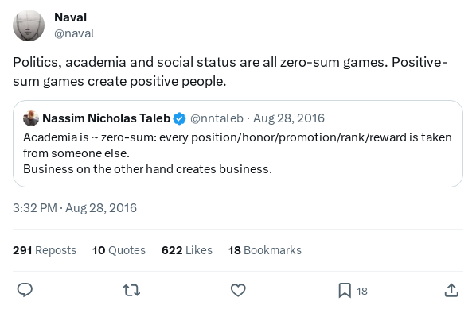

> "You have power over your mind - not outside events. Realize this, and you will find strength." ― Marcus Aurelius, Meditations

## Prologue

It is a cold Saturday evening and I sit beside a window staring at the freshly pruned front garden I had done earlier in the day.
I took some time this evening to walk out the door and get a stroll going. As usual, the streets are quiet, peaceful ... with not a single soul in sight. 

For most, this is less of a reality -- not all nights are as quiet. Leaving Nigeria some years ago gave me this new feel to life, I wrote about this in my 
article *[Some things don’t need to change (and that’s fine)
](https://tiemma.medium.com/some-things-dont-need-to-change-and-that-s-fine-ce53e854a33a)*

In my country Nigeria, we speak *alot* about the vile nature of politics and the leading party, the saddening amusement of the vegetable bullaba *"EmiLoKan"* and the 
enraging disputes by his supporters and critics. Decisions by the political parties has left the nation with a consistent decline year-on-year, further making day to day life abysmally difficult. So as my earlier article noted,
everyone is *hustling*. Any person in such difficulty would rarely have time for a stroll, especially when your financial and mental state is at an all-time low. 

However, I still notice these political powers at play outside Nigeria and to no-ones-shock, this is expected.

## What is politics?
Politics is the game of life, as [Wikipedia](https://en.wikipedia.org/wiki/Politics) better put it:
> Politics (from Ancient Greek πολιτικά (politiká) 'affairs of the cities') is the set of activities that are associated with making decisions in groups, or other forms of power relations among individuals, such as the distribution of resources or status ...

As systems evolve and more people actively contribute, there will always be leaders who strive for authority over the passive and less-competent populace. It is not possible for multiple heads to lead -- there must be a supreme voice.
Even countries themselves are held to authority by other more sovereign entities.[\[1\]](https://www.lawteacher.net/cases/z-v-uk.php)

On the basis of this, politics is born. Who gets the last say? Who makes the rules? Who is permitted to ~~amend~~ *coughs* workaround them?. 
To achieve these prospects, the evolution of politics begin as people and organisations ascend to become the sole authorities for these decisions.

## Politics and Society
Society by itself evolves into a political landscape in nuanced forms we have normalised. Why do we define classes for wealth and aspire to fit into these scales of ownership? To be seen as one of them is great but 
to be protected by authority of this knowledge is another. Ignoring the broader classes for simplicity, and we are born into two classes: Rich or Poor. 
Those on either side will either be delighted or nerve-wracked by those terms, it is widely known we get authority by being rich and far less of it with poverty.

To state the obvious, being rich grants you authority and money makes for this system of authority, however money is not enough in politics as I will later discuss. Politics does becomes easier in this monetary domain over the poor. Simply put, the poor 
do not engage in the game of politics by their own doing. 

As Naval would describe it, it is a zero-sum game. A zero-sum game is one in which no wealth is created or destroyed. [\[2\]](https://cs.stanford.edu/people/eroberts/courses/soco/projects/1998-99/game-theory/zero.html#:~:text=A%20zero%2Dsum%20game%20is,perfect%20information%20and%20those%20without.)
> Politics, academia and social status are all zero-sum games. Positive-sum games create positive people.

Despite being a zero-sum game, politics will always exist in any gathering of two or more people. This is true for relationships, gatherings, countries and the far bigger global landscape.
Group decisions will always be political, the absence of it does not promote its irrelevance.

## Why do we need politics?
Quoting back to my earlier note of *japa-ing* [\[3\]](https://en.wikipedia.org/wiki/Japa_(slang)), my first salary expectations were cut short by taxes. This however was not a surprise, its benefit to society cannot be overlooked.
Taxes prevent the rich from becoming too rich by their own doing, it is the equalizer in a progressive society that simply states: "the rich will pay more and the poor will earn more".

So how then does taxes relate to politics? In organisations, other forms of taxes exist to check authority. Heirarchies and departments are born to give the poor authority and serve them power in decisions -- you can liken this 
to the courts, FBIs, HRs and others, these organisations make you confident. This however does not negate authority, it only strives to provide some form of balance which the rich cannot control.

Amongst the rich to the rich, this powers of equality also exists and one party may not also oppress their own in their elitist society. To get ahead in this system is where the rough game
of politics is born. Authority must be subverted by more subtle means, nitpicking, public condescension etc. 

Politics is how to get ahead in a system that strives to maintain equity, a system that punishes self-serving mandates, a system that limits the concentration of power. As far as human greed exists,
so will politics. To answer my own question, since no man could eradicate greed from the aeons of humans existence, so also can no man deny the need for politics. 

## Is politics for the rich or the poor?
I pondered on this as I sat by the window staring into the quiet streets. As one who would be classified as poor by my own definition, I, by definition, do not expressly hold any political power of my own but I benefit from its existence.
Earlier, I made notes about the vile exploitative nature of politics and its self-serving nature. However, I do benefit from politics by its definition. No matter the fate of man, he will always hold some form of power in his own doing
and political means are how we maintain it -- the extent to which these means are expressed being the difference.

As a poor man, I am a political being. By manner of expression and presence, I guide you on this journey of thought and hold some authority over your perspective of this topic and in so doing, there is a form of 
political power at play -- indoctrination. On this note however, I had to learn to express myself to gain this as a poor man bears no notice except to himself.

One case I see with the rich is they are naturally indoctrinated with the varying forms of political plays and its theatrical performance. An example I note is why charity is harder to express for the rich without
gain, it is simply not a process they have followed from birth. The poor have the need to pool together to survive the winters when the rich can simply ignore it, the problems we face are out of sync.

However, both the poor and rich will aspire for authority in their respective societies. Both the poor and the rich will play their game of politics.

## How then do the poor embattle politically with the rich?
From my perspective, I rarely do see this evolution happening. Money, connections and authority gained through hard work and guise by the poor are to one end, self-serving for continuity.
To politically play with the rich, it is not enough to gain authority, the poor man must also learn to keep it. This as you can now understand is already difficult.

Earlier, I note how the rich are born into a political system. The indoctrination from birth makes it a lifelong journey, this is why we as folks can identify this class without acquiring knowledge of their wealth.
From their tone and mannerisms, one cannot be alluded to misidentify their presupposed delusions of authority over anything, anywhere they find themselves -- by any form of conversation and other forms of expression :-)

There are several poor folks who have learnt to embody these political skills to side the rich, the selfishness and cut-throat nature you see in a hedge fund is a nicer reflection of the hidden reality backing the 
grandiose displays of wealth the poor desire to have. To become embattled politically with the rich, one must embody these traits, one must pull themselves from the self-serving case of survival and evolve
to a different propensity to hold authority. 

For the poor to become embattled politically with the rich, the poor must be self-sufficient in a manner that allows them command the rich. *They must become the rich*.

## Where then lies the silver lining?
As earlier stated, the more competent and politically astute will (always) aspire for more authority. By my perspective, I seem to hold a Geniocratic [\[4\]](https://en.wikipedia.org/wiki/Geniocracy) or Technocratic [\[5\]](https://en.wikipedia.org/wiki/Technocracy) mindset but this is not absolute.

To be quite blunt, I do not think there is a silver lining. As the politically rich continue to delude the masses by offering scholarships rather than making education cheaper 
or by applying corrupt means to hold authority, the best the poor will continue to do is to survive.
> *"A hungry man is not a free man..."* — Adlai E. Stevenson

As the poor man in his own doing evolves from the systems that held him down, he will to his irony grow into identifying with the same political stance he once detested - only the ideologies of the rich are granted the grace to persist there.  It is only a matter of time and circumstance.
The world is not a fair place and meritocracy benefits the minority, not the masses. The Nigerian political space is more of a plutocracy [\[5\]](https://en.wikipedia.org/wiki/Plutocracy), leaning less for competence and more on elitism.

Even if the world evolved into a system of equity, it would slowly but surely return to its past political departure, but now, in discreet and systemic forms that are more futile to eradicate.

The world will after its grand era of change revert back to normal.

## Footnotes 
1 - [Z and Others v United Kingdom (Application No 29392/95)](https://www.lawteacher.net/cases/z-v-uk.php)

2 - [Zero Sum Games - Games where no benefit is made.](https://cs.stanford.edu/people/eroberts/courses/soco/projects/1998-99/game-theory/zero.html#:~:text=A%20zero%2Dsum%20game%20is,perfect%20information%20and%20those%20without.)

3 - [Japa](https://en.wikipedia.org/wiki/Japa_(slang))

4 - [Geniocracy - A system where the intelligent and compassionate rule](https://en.wikipedia.org/wiki/Geniocracy)

5 - [Technocracy - A system where leaders are chosen based on technical expertise](https://en.wikipedia.org/wiki/Technocracy)

6 - [Plutocracy - A system where the rich and wealthy rule](https://en.wikipedia.org/wiki/Plutocracy)