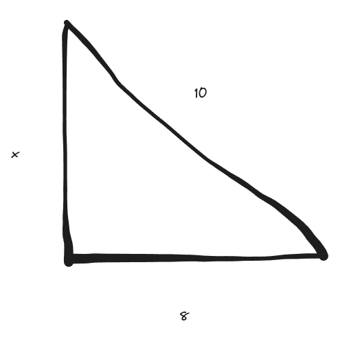
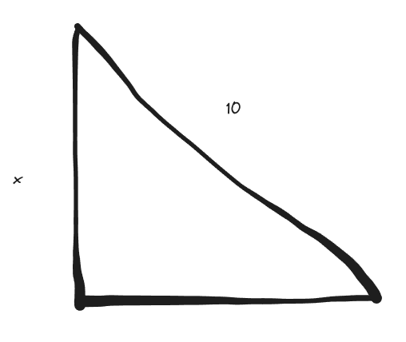
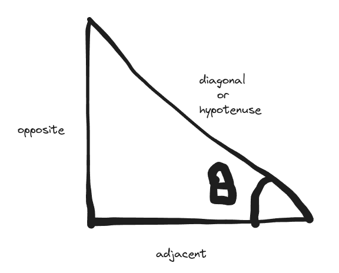

> Title is inspired by a recent Netflix watch: [The Secret Diary of a Call Girl](https://www.netflix.com/ie/title/70136150?source=35)

# Introduction
Dearest Gentle Reader, when I was in primary school some 10+ years that I can't accurately calculate again (the irony of it all), I had some assignment that involved calculating a single value out a pythagorean triple, two of the values were provided for ease.




However, one particular case did not appear properly as the page had folded during print and messed up the value leaving me with only one value needing to find the other two.



This article is based on me reminiscing ecstatically on a Friday night the experience I had figuring it out over a decade ago:
**how does one find the remaining two elements if given one element in a pythagorean triple?**


# What is a pythagorean triple?
Pythagoras theorem is applied when computing one end of the three sides of a right-angled (90 degree) triangle. 



A [pythagorean triple](https://mathworld.wolfram.com/PythagoreanTriple.html) is basically three elements (a, b, c) that satisfy:


$$a^2 + b^2 = c^2$$ 



# Starting simple with natural numbers
Natural numbers are all positive numbers excluding 0. This defines a metric system we can understand representing what a valid triangle would be constrained by.
Therefore, all numbers for the start of this exercise will be bounded within the [natural number space](https://en.wikipedia.org/wiki/Natural_number).


\\[ \forall b \in {\displaystyle \mathbb {N} } \\]


$$a$$ will represent either the adjacent or opposite, it does not matter which and $$c$$ will be the hypotenuse/diagonal.
To ease out the discussion in later parts of this article, these will exist in the positive [real number space](https://en.wikipedia.org/wiki/Real_number).


\\[ \forall a,c \in {\displaystyle \mathbb {R} } \ni \\{a \geq 1 \;and\; c > a\\} \\]



# Solving the problem
As earlier noted, a pythagorean expression is represented by

$$a^2 + b^2 = c^2$$


If we take any edge of the triangle asides the hypotenuse, the subject of the formula we arrive at is:

$$b^2 = c^2 - a^2$$


Factorising the expression leads to:

$$b^2 = (c + a) * (c - a) $$


Whenever, we have expressions in this form, we can take a factorization similar to computing the factors of a number. 
In this case, I factorise the expression to satisfy the equality as such:

$$c + a = b^2$$

$$c - a = 1$$


In doing so, I also define some expression that assumes there is a minimum distance $$k$$ which is a whole positive number that is based on the difference of c and a.

\\[ \forall k \in {\displaystyle \mathbb {N} } \ni k: k = c - a \\] 

In this case, we start off with 1 between the hypotenuse and the opposite. This will be pivotal in later exercises on defining what I call a "pythagorean distance" which I refer to as $$k$$.

For this example with a "pythagorean distance" of 1, we will sum the expression to eliminate  $$a$$  and compute the expression for the hypotenuse.


$$c + a = b^2$$

$$c - a = 1$$

--------------

$$2* c = b^2 + 1$$


This expands to the following expression for calculating the hypotenuse of a pythagorean triple.


$$c = \frac{1}{2} (b^2 + 1)$$



Doing the same with $$a$$ gives

$$a = \frac{1}{2} (b^2 - 1)$$



However, in using this formula, we must consider the earlier equalities:


$$c + a = b^2$$

$$c - a = 1$$



When considering the equalities, we must enforce that $$c + a > c - a$$. This is because in our natural number space without 0, we cannot have an addition greater or equal to a subtraction.

Substituting that $$c + a = \frac{b^2}{k}$$ and  $$k = c - a = 1$$, we have that $$b ^ 2 > 1$$, implying $$b > 1$$


\\[ \forall a,c \in {\displaystyle \mathbb {N} }, c+a > c-a  \\]

\\[ \therefore \frac{b^2}{k} > k \\]

\\[ \therefore b^2 > k^2 \\]

\\[ \therefore b > k \\]


# Testing the assertions
Now, let's test our formula with some simple math and python.

> NOTE: The code down here is better than spaghetti but pasta is pasta :-P

```python
import math
from fractions import Fraction

distances = 100
n = 100

def csv_print(*args, log):
    log.append(','.join(map(str, args)))
    # print(*args, sep=",")


for k in range(1, distances+1):
    data = []
    data_fractions = []
    csv_print("a", "b", "c", log=data)
    csv_print("a", "b", "c", log=data_fractions)
    for b in range(n+1):
        if b <= k:
            continue
        c = (1/2) * (math.pow(b, 2) / k + k)
        a = (1/2) * (math.pow(b, 2) / k - k)
        is_triple = math.pow(c, 2) == math.pow(a, 2) + math.pow(b, 2)
        csv_print(a, b, c, log=data)
        csv_print(Fraction(a), Fraction(b), Fraction(c), log=data_fractions)

    with open(f"pythagorean-triple-csv-generator_{k}.csv", 'w') as csvfile:
        csvfile.write('\n'.join(data))

    # I do this to handle issues with precision handling but it's not great in python
    # reason: is_triple = math.pow(c, 2) == math.pow(a, 2) + math.pow(b, 2)
    # is_triple will show false due to precision mismatch on the power and not be correct
    # I have checked and the values are fine, this will be my suffering for using python, lol
    with open(f"pythagorean-triple-csv-generator_fractions_{k}.csv", 'w') as csvfile:
        csvfile.write('\n'.join(data_fractions))
```

As you will see in the table, we now have a functioning way to calculate pythagorean triples for any number $$b$$ within our natural number space.
<table>
  
    
    <tr>
      
        <th>{{ pair[0] }}</th>
      
    </tr>
    

    
      {{ pair[1] }}
    

</table>

In this example, you can realise that only the odd values have whole pythagorean triples with the even values of $$b$$ violating our natural number space requirements.
In the next sample, we will work through variants of the established pythagorean distance vector $$k$$ in fixing these cases.


# Extending our pythagorean distance
In our previous example, we have established the formula works and we will arrive at pythagorean triples with a distance of 1 established by $$k = c - a$$. See the table above to validate this.

However, we have even numbers that do not express their triples as whole numbers. This can be fixed by increasing our pythagorean distance vector $$k$$ to 2.


Let us start again from our factorization of 


$$b^2 = (c + a) (c - a) $$


Let's take the factors to be fractional in this case where they are divided and increased by 2.

$$c + a = \frac{b^2}{2} $$

$$c - a = 2$$


Solving for c gives the following outcome for the simultaneous equation:

$$c + a = \frac{b^2}{2}$$

$$c - a = 2$$

--------------

$$2* c = \frac{b^2}{2} + 2$$


We arrive finally at

$$c = \frac{1}{2} (\frac{b^2}{2} + 2)$$


Solving for a also gives

$$a = \frac{1}{2} (\frac{b^2}{2} - 2)$$



Using our fancy script, we regenerate the values for our table and we now have the opposite case with even values giving whole number and odd values giving fractional numbers.
<table>
  
    
    <tr>
      
        <th>{{ pair[0] }}</th>
      
    </tr>
    

    
      {{ pair[1] }}
    

</table>

We also notice that in this even case, the odd sample for 2 in the earlier table `1.5,2,2.5` when multiplied by 2 gives us the even values `3,4,5` for the now established whole value of 2 in the even table.
This is an occurrence we will discuss later in this blog, pythagorean triples can be commutative where multiples of the linear values also correlate to the outcome of the quadratic expressions.

# Establishing finding pythagorean triples with pythagorean distances
When thinking about pythagorean triples, we usually have a hard time figuring out a pattern. However, this simplified when you consider there is a trick to it.

With the single value $$b$$ which can exist with any distance from $$a$$ and $$c$$, $$a$$ and $$c$$ will always have a fixed distance from each other.

With this, you arrive at a conclusion where the triples can be established with some pythagorean distance $$k$$ such that all the members of this threesome satisfy each other (lol!)


\\[ \forall b \in {\displaystyle \mathbb {N} }, \exists \;a \;,\; c \in {\displaystyle \mathbb {R} } \;forming \;a \;pythagorean \;triple \;\ni \; k \in {\displaystyle \mathbb {N} } \; \\{k = c - a \\} \\]


\\[ \therefore c = \frac{1}{2} (\frac{b^2}{k} + k) \\]

\\[ \therefore a = \frac{1}{2} (\frac{b^2}{k} - k) \\]


The expression above forms the universal pythagorean triple calculator based on some distance, this therefore implies that a single value $$b$$ can produce multiple pythagorean triples dependent on what distance you apply. 

Taking $$k = 3$$ as we have done for 1  and 2, we arrive at the same outcome. 9 for example produces 12 and 15 here whilst it produced 40 and 41 in the table for k=1.
<table>
  
    
    <tr>
      
        <th>{{ pair[0] }}</th>
      
    </tr>
    

    
      {{ pair[1] }}
    

</table>

From here, we have established a formula to calculate any pythagorean triple within the real number space, however satisfying that the numbers are in the natural number space is experimental and I cover my approach to defining a boundary at the end of this article.

# Multiples of pythagorean triples
Within the same pythagorean distance $$k$$, you will find that several series of digits repeat. This means that pythagorean triples repeat within different sets as multiples.

For example, within $$k=4$$, we get the following sequence
<table>
  
    
    <tr>
      
        <th>{{ pair[0] }}</th>
      
    </tr>
    

    
      {{ pair[1] }}
    

</table>

Within this sequence, we can use this value:
```
2.5,6,6.5
```

If we multiply this value by 2 to remove the fractions, we will get another pythagorean triple
```
5,12,13
```

However, you will notice 12 has another set of pythagorean triples different from what we would expect
```
16,12,20
```

When pythagorean triples run, you can have multiple sets within the natural number space with different pythagorean distances. In this case, both examples have $$k$$ with values of 8 and 4 respectively when $$b=12$$.

Taking another from $$k=2$$ and multiplying it by 2 for example gives one example on the table
```angular2html
3,4,5 -> 6,8,10
```

What you will find in examining pythagorean triples using the pythagorean distance approach is that triples will repeat and they are multiplicative reflections of each other.
Some will exist within the same distance if the distance repeats or extend into other versions of $$k$$.

# Prime behaviour for deriving original pythagorean triples
In succession to the chapter on repeating triples, you will find that getting new pythagorean triples is a matter of computing prime versions of $$b$$ and establishing multiples of the related triple combinations.

All of this can be automated using the [Sieve of Eratosthenes](https://www.geeksforgeeks.org/sieve-of-eratosthenes/) or better yet, [Prime factorization using the square root method](https://byjus.com/maths/square-root-prime-factorization)


# Weird patterns in getting whole triples
> This addition is inconclusive, incorrect on some cases and left for reader interest

With the single value $$b$$ which can exist with any distance from $$a$$ and $$c$$, $$a$$ and $$c$$ will always have a fixed distance from each other.

If I take my pythagorean distance $$k = c - a$$, I will find that we satisfy our natural number requirements of having whole number triples when $$b \% k  = 0 \;if\; k \% 2 = 0 $$ but only when k is even. If it is a power of 2, we find that it will work provided the value is at least a multiple of $$ k / 2 $$.

However, if $$k$$ is odd, then the multiple of $$k$$ that gives $$b$$ that satisfies this equality must also be odd. So any multiple of $$2 * k $$ will not satify our natural number requirement.

We finally assert that $$b \% k  = 0 \;if\; (b / k) \% 2 = 0 $$ for multiples of k that are odd.


This ends up with this conditional boundary asserting how to arrive at whole pythagorean triples using this pythagorean distance concept. However, this fails for 40 and others making me believe there's a case with multiples of 8. 

![](http://mathurl.com/render.cgi?%5Cdocumentclass%7Barticle%7D%0A%5Cusepackage%7Bamsmath%7D%0A%0A%5Cbegin%7Bdocument%7D%0A%20%20%5C%5B%0A%20%20%20%20X%28a%2Cb%2Cc%29%5Cin%20%7B%5Cdisplaystyle%20%5Cmathbb%20%7BN%7D%20%7D%20%3D%20%5Cleft%5C%7B%5Cbegin%7Barray%7D%7Blr%7D%0A%20%20%20%20%20%20%20%20b%20%5C%25%20k%20%3D%200%2C%20%26%20%5Ctext%7Bif%20%7D%20k%20%5C%3Bis%20%5C%3Beven%20%5C%3Band%20%5C%3Bnot%20%5C%3Ba%20%5C%3Bpower%20%5C%3Bof%20%5C%3B2%5C%5C%0A%20%20%20%20%20%20%20%202%20*%20b%20%5C%25%20k%2C%20%26%20%5Ctext%7Bif%20%7D%20k%20%5C%3Bis%20%5C%3Beven%20%5C%3Band%20%5C%3Ba%20%5C%3Bpower%20%5C%3Bof%20%5C%3B2%5C%5C%0A%20%20%20%20%20%20%20%20%28b%5C%25k%29%20%3D%200%20%5C%3Band%5C%3B%20%28b/k%29%20%5C%25%202%5C%3B%20%21%3D%200%2C%20%26%20%5Ctext%7Bif%20%7D%20k%20%5C%3Bis%20%5C%3Bodd%20%5C%3Band%20%5C%3Bthe%20%5C%3Bmultiple%20%5C%3Bof%20%5C%3Bk%20%5C%3Bis%20%5C%3B%20odd%0A%20%20%20%20%20%20%20%20%5Cend%7Barray%7D%5Cright%5C%7D%0A%20%20%5C%5D%0A%5Cend%7Bdocument%7D%5Cnocachehttp://mathurl.com/render.cgi?%5Cdocumentclass%7Barticle%7D%0A%5Cusepackage%7Bamsmath%7D%0A%0A%5Cbegin%7Bdocument%7D%0A%20%20%5C%5B%0A%20%20%20%20X%28a%2Cb%2Cc%29%5Cin%20%7B%5Cdisplaystyle%20%5Cmathbb%20%7BN%7D%20%7D%20%3D%20%5Cleft%5C%7B%5Cbegin%7Barray%7D%7Blr%7D%0A%20%20%20%20%20%20%20%20b%20%5C%25%20k%20%3D%200%2C%20%26%20%5Ctext%7Bif%20%7D%20k%20%5C%3Bis%20%5C%3Beven%20%5C%3Band%20%5C%3Bnot%20%5C%3Ba%20%5C%3Bpower%20%5C%3Bof%20%5C%3B2%5C%5C%0A%20%20%20%20%20%20%20%202%20*%20b%20%5C%25%20k%2C%20%26%20%5Ctext%7Bif%20%7D%20k%20%5C%3Bis%20%5C%3Beven%20%5C%3Band%20%5C%3Ba%20%5C%3Bpower%20%5C%3Bof%20%5C%3B2%5C%5C%0A%20%20%20%20%20%20%20%20%28b%5C%25k%29%20%3D%200%20%5C%3Band%5C%3B%20%28b/k%29%20%5C%25%202%5C%3B%20%21%3D%200%2C%20%26%20%5Ctext%7Bif%20%7D%20k%20%5C%3Bis%20%5C%3Bodd%20%5C%3Band%20%5C%3Bthe%20%5C%3Bmultiple%20%5C%3Bof%20%5C%3Bk%20%5C%3Bis%20%5C%3B%20odd%0A%20%20%20%20%20%20%20%20%5Cend%7Barray%7D%5Cright%5C%7D%0A%20%20%5C%5D%0A%5Cend%7Bdocument%7D%5Cnocache)


# Conclusion
Decade long interests in math can have long-lasting benefits such as sleep deprivation and hyper-focus during these kinds of nostalgic moments.

I found writing this exciting and I hope you all as my "Dearest Gentle Readers" found this gossip amusing.

If you enjoyed this, I write about math problems I remember from day to day, one interesting being this optimisation case for [Project Euler, Problem 25](https://medium.com/an-idea/solving-project-euler-problem-25-4318b8df8bf7). Do send me those you also come across day-to-day.

As with the case of establishing a boundary for the various conditions under "Weird patterns in getting whole triples", I find this exercise would be more than encouraging for those who love to venture into numerical patterns. I wish you the best in those endeavours and I would love to hear about your findings, email: me[at]bakman[dot]build with what you find.

Code for the simulations done for this article can be found here: [https://github.com/tiemma/unravelling-mathematical-threesomes](https://github.com/tiemma/unravelling-mathematical-threesomes) and a summary of mathematical symbols used in this article can be found here: [https://en.wikipedia.org/wiki/Glossary_of_mathematical_symbols](https://en.wikipedia.org/wiki/Glossary_of_mathematical_symbols )


<style>
img {
    min-height: unset !important;
    width: unset !important;
}
</style>

